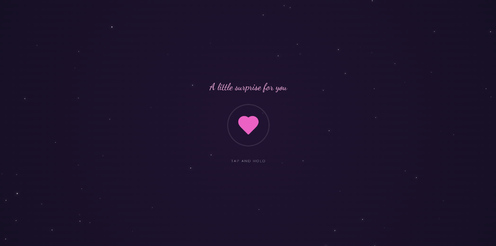
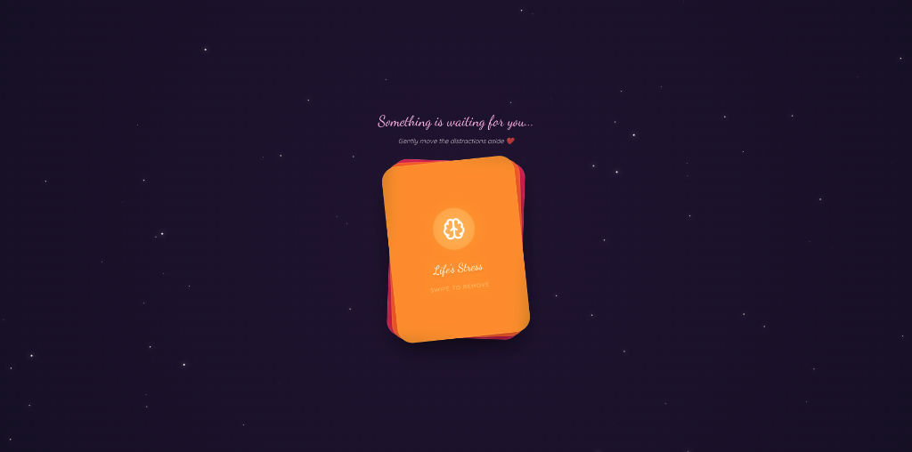
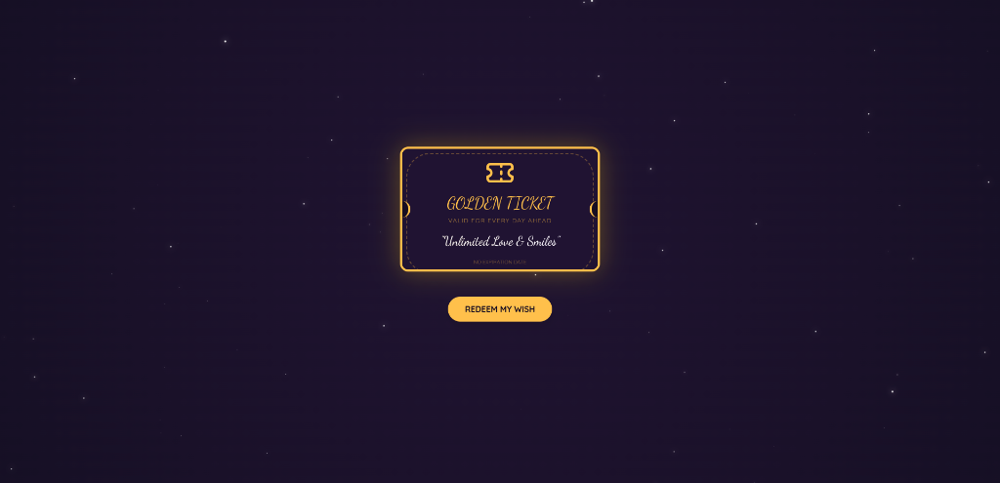

# ❤️ Happy New Year

A romantic, interactive "Year-in-Review" web application built with Next.js, Framer Motion, and Tailwind CSS. Designed to celebrate cherished memories with a beautiful, animated user experience.


<div align="center">
  
  
  
  
  
</div>

## ✨ Features

-   **Interactive Gateway**: "Hold to Unlock" mechanic with smooth circular progress animations.
-   **Memory Vault**: A stack of Polaroid-style photo cards that can be swiped through.
-   **Final Reveal**: A 3D flipping card with a heartfelt message.
-   **Responsive Design**: Optimized for different screen sizes (though best experienced on mobile/tablet).
-   **Premium Aesthetics**: Custom fonts (Dancing Script, Quicksand), subtle animations, and a deep, romantic color palette.

## 🛠️ Tech Stack

-   **Framework**: [Next.js 16](https://nextjs.org/) (App Router)
-   **Styling**: [Tailwind CSS](https://tailwindcss.com/)
-   **Animations**: [Framer Motion](https://www.framer.com/motion/)
-   **Deployment**: [Firebase Hosting](https://firebase.google.com/docs/hosting)

## 🚀 Getting Started

### Prerequisites

-   Node.js (v18 or later)
-   npm

### Installation

1.  Clone the repository:
    ```bash
    git clone https://github.com/Ankitsaroj94/romantic-year-wish.git
    cd romantic-year-wish
    ```
2.  Install dependencies:
    ```bash
    npm install
    ```

### Running Locally

To run the development server:

```bash
npm run dev
```

To run the production build locally (accessible on your network):

```bash
npm run build
npm run start:host
```

Open [http://localhost:3000](http://localhost:3000) with your browser to see the result.

## 📦 Deployment

This project is configured for **Firebase Hosting**.

1.  Build the project (static export):
    ```bash
    npm run build
    ```
    *This generates static HTML files in the `out` directory.*

2.  Deploy to Firebase:
    ```bash
    firebase deploy
    ```

## 📂 Project Structure

-   `app/`: Main application logic and pages (Next.js App Router).
-   `components/`: Reusable UI components (Gateway, MemoryVault, FinalReveal).
-   `public/`: Static assets (images, icons).
-   `out/`: Static export output (generated after build).

## 📄 License

This project is open source and available under the [MIT License](LICENSE).
